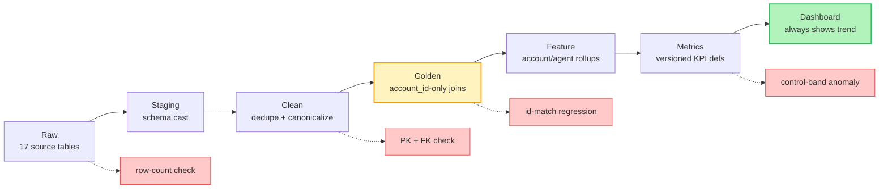

```mermaid
flowchart LR
    Raw["Raw<br/>17 source tables"] --> Staging["Staging<br/>schema cast"]
    Staging --> Clean["Clean<br/>dedupe + canonicalize"]
    Clean --> Golden["Golden<br/>account_id-only joins"]
    Golden --> Feature["Feature<br/>account/agent rollups"]
    Feature --> Metrics["Metrics<br/>versioned KPI defs"]
    Metrics --> Dashboard["Dashboard<br/>always shows trend"]

    Raw -.-> DQ1["row-count check"]
    Clean -.-> DQ2["PK + FK check"]
    Golden -.-> DQ3["id-match regression"]
    Metrics -.-> DQ4["control-band anomaly"]

    style Golden fill:#fff3bf,stroke:#f59e0b,stroke-width:2px
    style Dashboard fill:#b2f2bb,stroke:#22c55e,stroke-width:2px
    style DQ1 fill:#ffc9c9,stroke:#ef4444
    style DQ2 fill:#ffc9c9,stroke:#ef4444
    style DQ3 fill:#ffc9c9,stroke:#ef4444
    style DQ4 fill:#ffc9c9,stroke:#ef4444
```